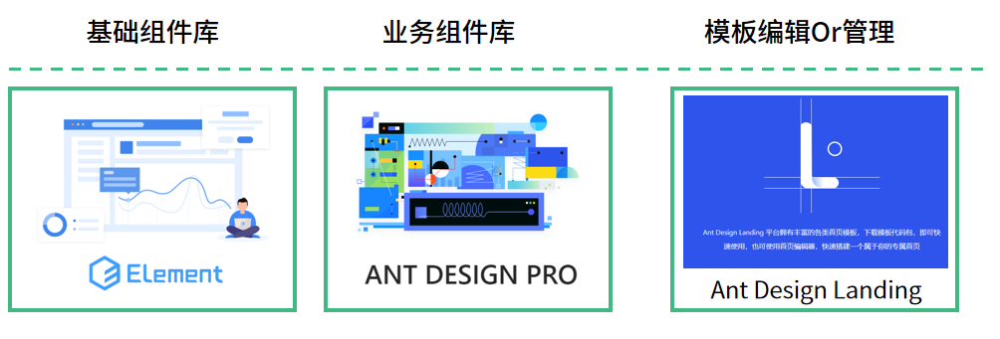
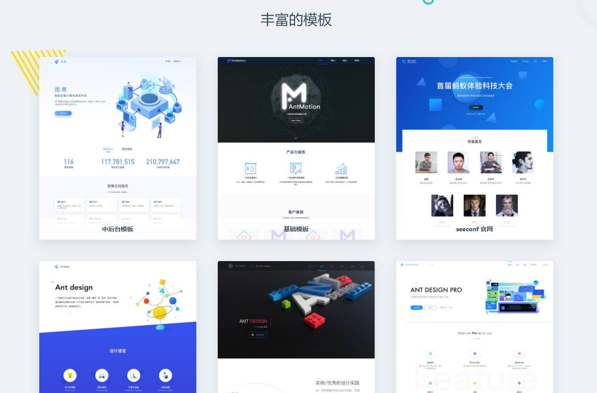
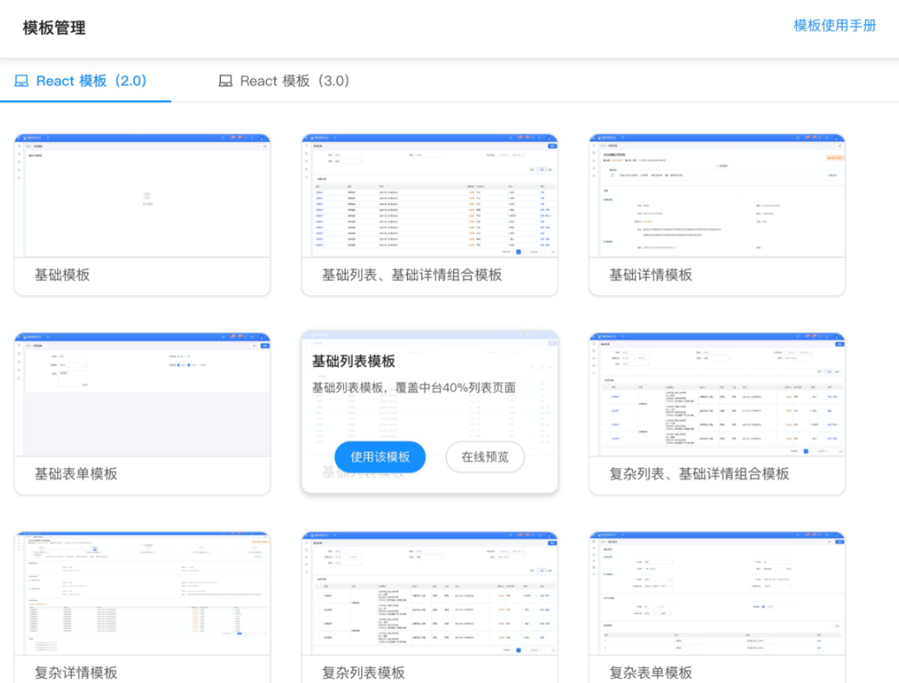
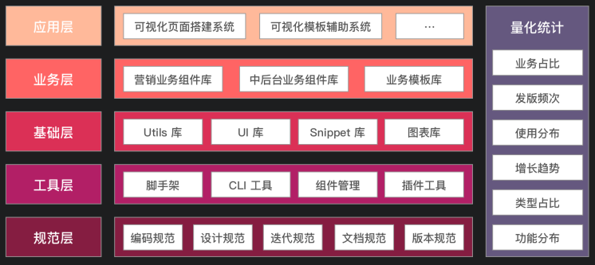
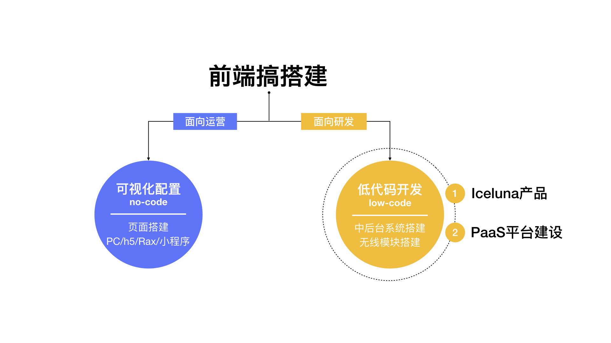
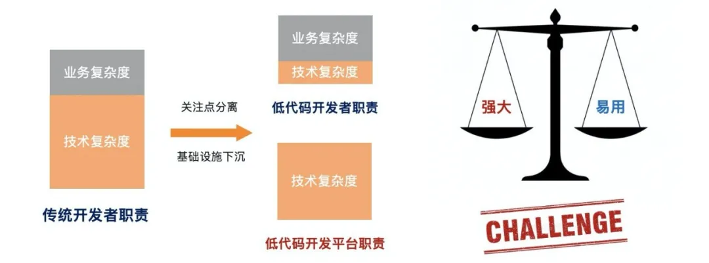
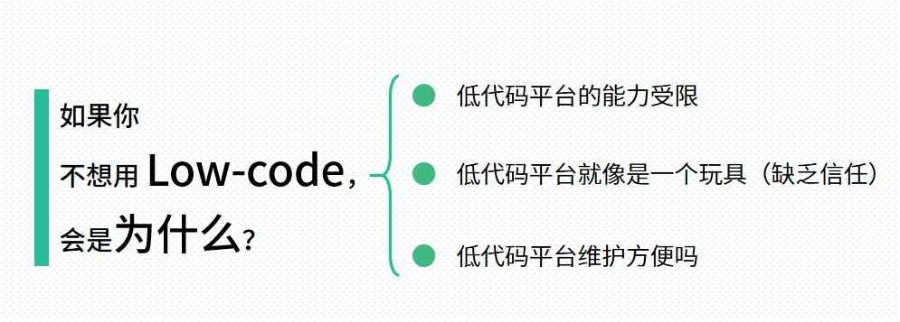
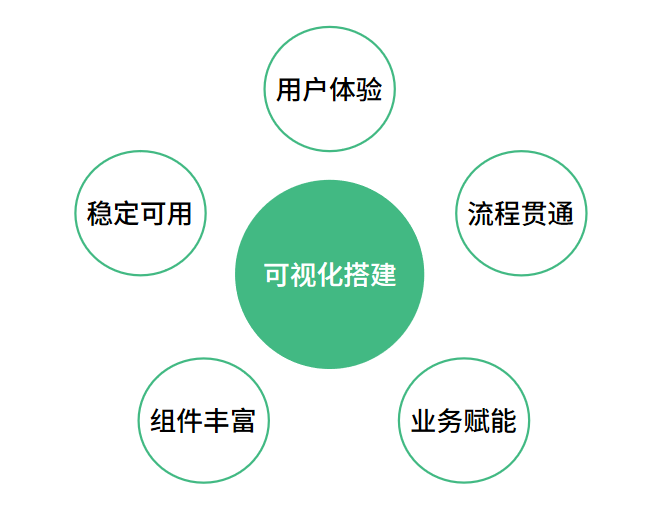
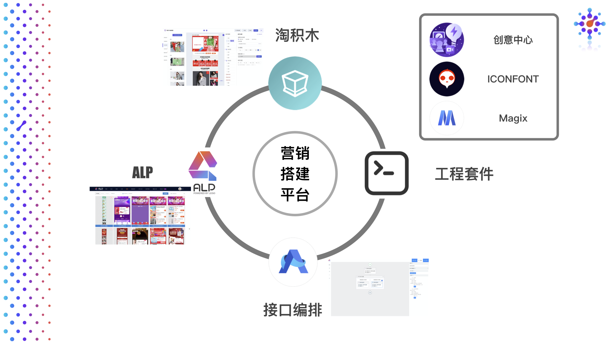

# 【Dawnlck】2020 前端可视化搭建小报告- 01 - 背景调研

> Gathered & writen by [Dawnlck 在掘金][author]

> 本次小报告因为篇幅的考虑，分成了三块：背景调研 - 架构和难点 - 业内成果陈列，此篇是第一部分，会从四个维度（What、Who、Why、How）来介绍前端可视化搭建。

## 0. 一些前置的知识

### 常见的可复用代码片段的粒度

从可复用代码片段的颗粒度来看，我们通常接触到的概念如下：

**基础组件**、**业务组件（区块\微件）**、**模板（页面主体）**

- 基础组件，如各大组件库所完成的细粒度组件，`Button` \ `Input` \ `Form`等。
- 业务组件，针对不同项目的业务场景，有一些场景可复用但不足以泛用的颗粒度较大的组件，我们将其封装为业务组件。
- 模板，颗粒度最大的组件，如活动页、表单页面模板、后台管理页模板、数据可视化模板，这些都是经过大量业务实践，证实可复用的页面主体架构

前两者我们可以通过组件库和业务微件库，形成通用的代码片段仓库，而模板我们也可以借由 GUI（图形用户界面，也可称为可视化管理平台），管理我们在业务中遇到的常用模板。

模板搭建平台中，**Ant Design Landing** 应该是比较典型且有知名度的解决方案。

它是一个面向产品首页的快速搭建解决方案，包含了丰富的模板和模板里对应的模块，同时提供了一个在线的编辑器。

这里还有一张个人觉得很不错的由**政采云团队**完成的模板可视化管理平台的截图，如下

## 1. What 可视化搭建是什么？

**可视化搭建** 是指在图形界面上，通过一系列的编辑操作，在极短时间内便能完成一个复杂的页面并发布上线。

**可视化搭建** 是一个工具，是一个脚手架，也是一个业务加速器和创意制作平台。

**可视化搭建** 是高效利用组件的前端上层建筑，作为一个庞大的可视化前端应用, 它建立在大量的前端基建（如代码规范、脚手架、组件库、框架等）之上。

下图描述了可视化搭建在技术开发层面的具体位置，也可以作为可视化搭建的架构示例。

## 2. Who 可视化搭建面向谁？

面向谁是一个很关键的问题：

- 如果面向的是**营销页面**或者**产品主页**的搭建，使用者通常是**非开发者**，整体的可视化解决方案就会更偏近 no-code，也就是我们所说的的零代码。
- 如果面向的是**中后台页面搭建**，使用者是**开发者**，整体的可视化解决方案就会更偏近 low-code，也就是低代码。

虽然最终的目标是实现所有页面的零代码化，但是对于技术逻辑和业务逻辑比较复杂的场景，还是需要做一些定制的。

## 3. Why 为什么做可视化搭建？

> 随公司业务不断发展，营销活动、广告、页面改版等需求日益倍增，靠纯人工撸代码已经无法跟上需求增长速度。加班？招人？显得不够明智，也不够前端，提效也就成为了关键。如何提效？从何入手？那不得不提的就是前端提效神器 —— 可视化搭建系统。

> 当组织团队达到一定的开发规模时，页面可视化搭建是一个减少冗复开发、释放生产力的最有效方案。

> 低代码能让不懂代码的业务人员成为所谓的平民开发者（Citizen Developer），弥补日益扩大的专业人才缺口，同时促成业务与技术深度协作的终极敏捷形态（BizDevOps）

对于传统开发者而言，在实际的业务开发过程中，既要关注业务复杂度，又要关注技术复杂度，而低代码平台（可视化搭建）就是为了尽可能地屏蔽掉技术细节，转移出大部分的技术复杂度，从而减轻业务线开发的负担。

总结一下前端可视化搭建要实现的目标：

1. 实现业务快速交付
2. 降低业务开发成本

而对于前端可视化搭建的**愿景**，初步的理解可以如下：

调动所有非前端开发人力，释放前端开发的工作量，让**人人都能参与到页面的搭建中**，提升项目的交付效率。

当然可视化搭建的未来远不止于此，比如**Serverless**、**DevOps 全链路的打通**、**结合 AI 的应用**等。

除此之外，还有一些针对用户的“为什么”的问题需要讨论：如果开发或者非开发不想用低代码平台，是会因为什么？

1. 低代码平台的能力受限

   按照目前的低代码平台产品来看，大家的应用场景和成熟度大不相同，**具体的价值还是得结合业务场景和使用频次来考量这件事情**。如果只是应用模板完成业务的低代码平台，它本身就不需要特别复杂的能力，能快速产出可上线的宣传页面就行。如果是涉及大量业务逻辑的中后端平台，低代码也能帮助我们减少许多重复的工作，让开发者专注于业务逻辑。

2. 低代码平台就像是一个玩具，我不了解它的内部逻辑，也没有办法相信它产出的质量

   浏览器刚出来的时候，大家也不会说主动了解它的内核运行机制，所以关键还是，能不能**用起来**、**用得爽**、**用得放心**，这需要我们持续地建立数据收集和分析。除此之外，关于安全合规以及漏洞风险的考虑，也是在低代码平台开发过程中需要考虑的，我们可以多让大家用起来，调动用户帮助我们寻找其中的漏洞，并建立安全机制，防止有人恶意攻击。

3. 低代码平台维护起来方便吗？

   成熟的低代码平台能提供规范的接口、完整的构建发布链、质量保障体系以及简便明了的操作，**如果连产品经理都能随时维护，作为一个开发者还有什么需要担心的。**

## 4. How 怎么做可视化搭建？

**基础思路:** 先调用一个模板作为基础骨架，然后通过控制组件的属性，通过少量的代码调整，使得大致的页面效果能够与业务高保真图保持一致，最后接入数据接口，进入构建、测试和发布流程。

我们也可以从可视化搭建解决的痛点，或者说具有的能力维度，来分析这件事情。

。

阿里云原生技术团队列出了低代码平台的三个核心能力：

为了达成这样的能力维度或者实现这样的核心能力，其实需要很多层面的支撑，如**工具链**、**物料平台**、**工程套件**、**接口编排**等，下面展示了一张阿里妈妈的产品家族，大家可以略窥一二。

关于架构层和一些实现的难点，移至下文中展开介绍。

## # 参考文章

这里很多资料，来源于本人参与的早早聊大会的讲师 PPT 材料，在这其中我也做了一些筛选和整合，加入了自己制作的图表，也欢迎各位关注这个干货满满的会议。

再列举一些其他参考的文章或者网站：

1. [《前端工程实践之可视化搭建系统（一）》][doc_01]
2. [《MPM 卖场可视化搭建系统 — 要素设计》][doc_02]
3. [Github - awesome-lowcode][awesome-lowcode]
4. [《阿里云原生 - 什么是低代码（Low-Code）？》][aliyun-lowcode]
5. [Wiki - 低代码开发平台][wiki-lowcode]
6. [《腾讯 - AlloyTeam - 页面可视化搭建工具技术要点》][alloyteam]

[author]: https://juejin.cn/user/1028798614345032
[awesome-lowcode]: https://github.com/taowen/awesome-lowcode
[doc_01]: https://mp.weixin.qq.com/s/tPcIXCCQkdSXr_gTi8KT6A
[doc_02]: https://mp.weixin.qq.com/s?__biz=MzI5NjIzNjA1Nw==&mid=2247484054&idx=1&sn=f56e55e4dfdcea481e7881f9201f0c3b&chksm=ec4627e0db31aef6459de3c83e3bb320d2d7bc395de2a0aa5d595168de9d1f505099cb6374be&scene=178&cur_album_id=1581972507954315265#rd
[aliyun-lowcode]: https://juejin.cn/post/6900791928477417480
[wiki-lowcode]: https://zh.wikipedia.org/zh-cn/%E4%BD%8E%E7%A8%8B%E5%BC%8F%E7%A2%BC%E9%96%8B%E7%99%BC%E5%B9%B3%E5%8F%B0
[alloyteam]: http://www.alloyteam.com/2019/07/h5-build-tool-pipeline/
