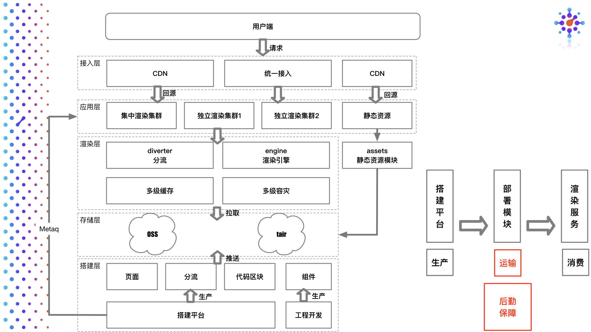
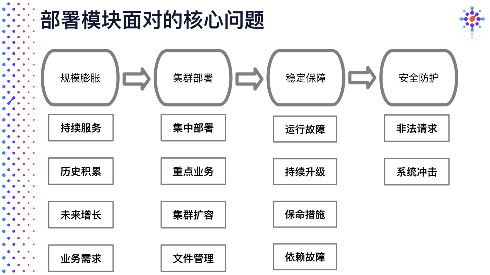
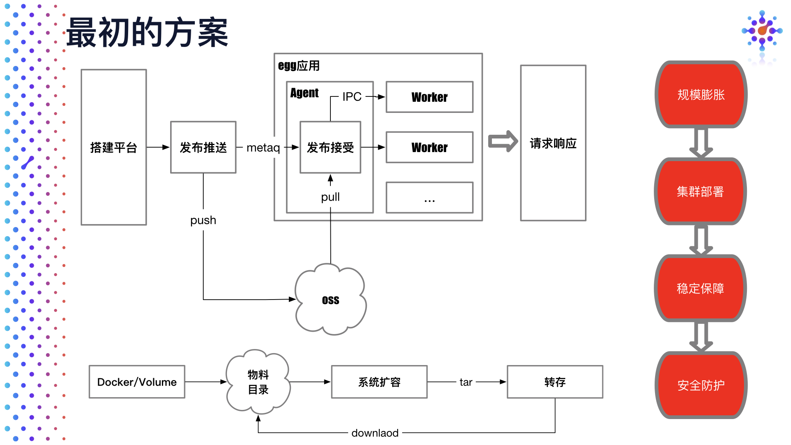
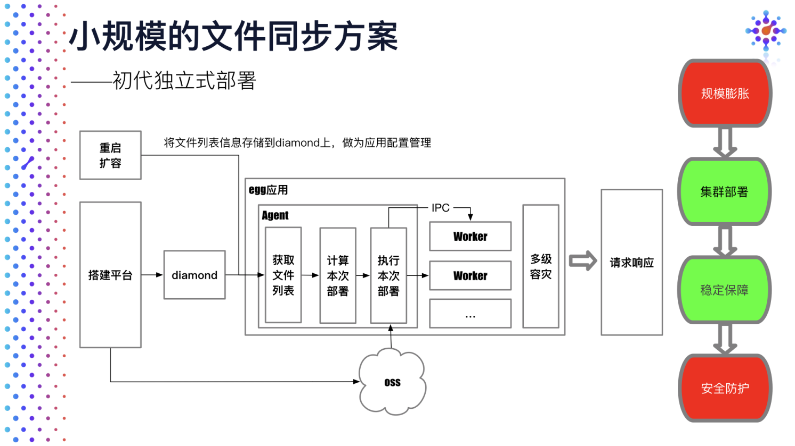
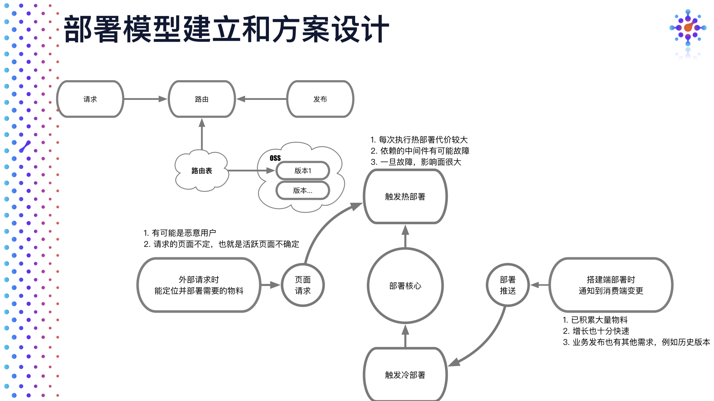
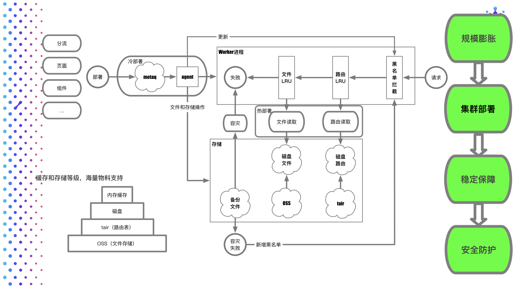

# 【Dawnlck】2020 前端可视化搭建小报告- 02 - 架构和难点

> Gathered & writen by [Dawnlck 在掘金][author]

## 1. 可视化搭建架构

废话不多说，放上收集到的一些架构图：

1. 政采云 - 鲁班架构图

   

2. 京东 - MPM

   

3. 阿里淘系技术部 - iceluna

   

4. 阿里淘系技术部 - imgcook

   

5. 阿里妈妈 - 淘积木

   

从这些优秀的项目架构中，我总结出以下的一张更为清晰明了的架构图：

## 2. 低代码可视编辑器 Low-code Visual Editor

## 3. 多端适配

1. iceluna - 多端适配

   

2. MPM - 多端适配

   

## 4. 物料和组件流通

## 5. 数据模型 Model / 数据约束 Schema

## 6. 海量部署

可能会遇到的一些关键性问题：

1. Node 缓存回收机制阈值管理
2. IPC 大文件传输
3. 冷部署和热部署、容灾管理

## 7. 其他的一些思考

实现前端可视化搭建是一个耗时长久的工程，期间可能还会遇到以下技术难点：

1. 无限画布
2. 容灾系统
3. 代码可用率
4. 多端多框架对接
5. 多人协同

## # 参考文章

这里很多资料，来源于本人参与的早早聊大会的讲师 PPT 材料，在这其中我也做了一些筛选和整合，加入了自己制作的图表，也欢迎各位关注这个干货满满的会议。

再列举一些其他参考的文章或者网站：

1. [《前端工程实践之可视化搭建系统（一）》][doc_01]
2. [《MPM 卖场可视化搭建系统 — 要素设计》][doc_02]
3. [Github - awesome-lowcode][awesome-lowcode]
4. [《阿里云原生 - 什么是低代码（Low-Code）？》][aliyun-lowcode]
5. [Wiki - 低代码开发平台][wiki-lowcode]
6. [《腾讯 - AlloyTeam - 页面可视化搭建工具技术要点》][alloyteam]

[author]: https://juejin.cn/user/1028798614345032
[awesome-lowcode]: https://github.com/taowen/awesome-lowcode
[doc_01]: https://mp.weixin.qq.com/s/tPcIXCCQkdSXr_gTi8KT6A
[doc_02]: https://mp.weixin.qq.com/s?__biz=MzI5NjIzNjA1Nw==&mid=2247484054&idx=1&sn=f56e55e4dfdcea481e7881f9201f0c3b&chksm=ec4627e0db31aef6459de3c83e3bb320d2d7bc395de2a0aa5d595168de9d1f505099cb6374be&scene=178&cur_album_id=1581972507954315265#rd
[aliyun-lowcode]: https://juejin.cn/post/6900791928477417480
[wiki-lowcode]: https://zh.wikipedia.org/zh-cn/%E4%BD%8E%E7%A8%8B%E5%BC%8F%E7%A2%BC%E9%96%8B%E7%99%BC%E5%B9%B3%E5%8F%B0
[alloyteam]: http://www.alloyteam.com/2019/07/h5-build-tool-pipeline/
