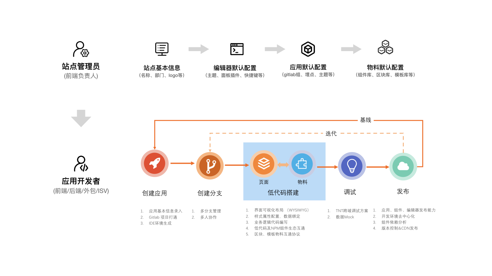
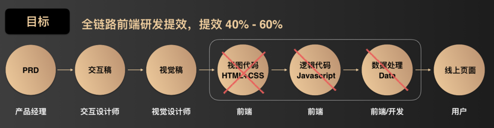
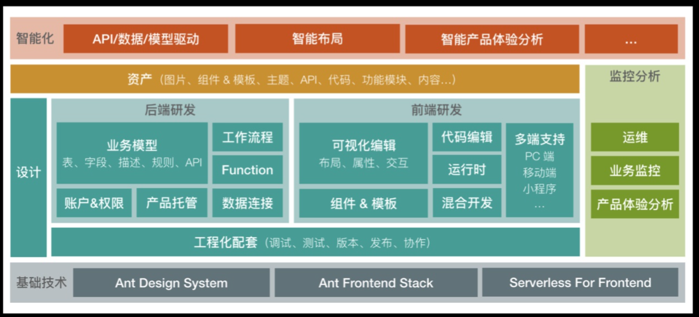
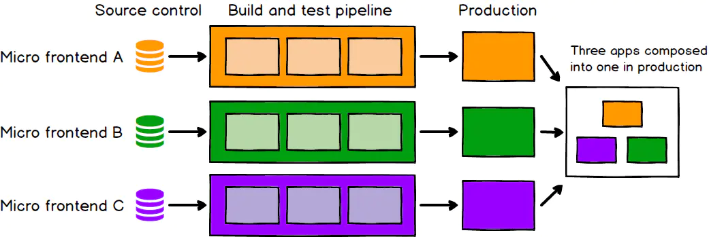
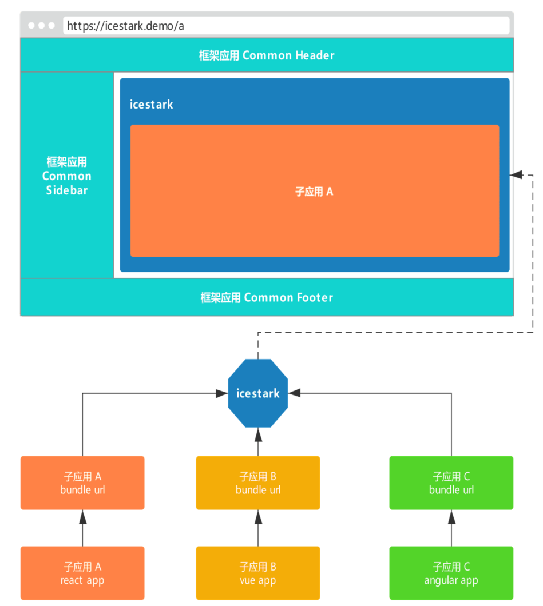
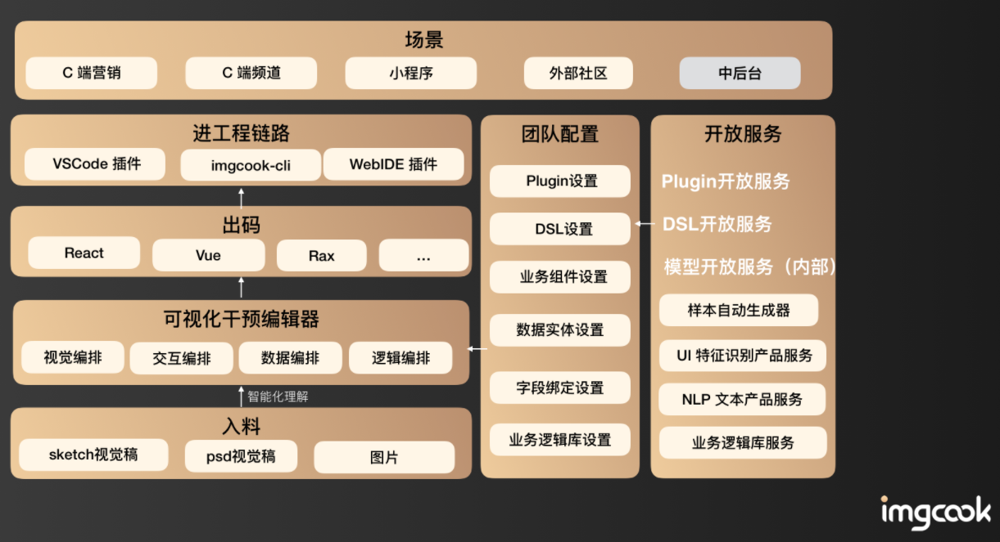
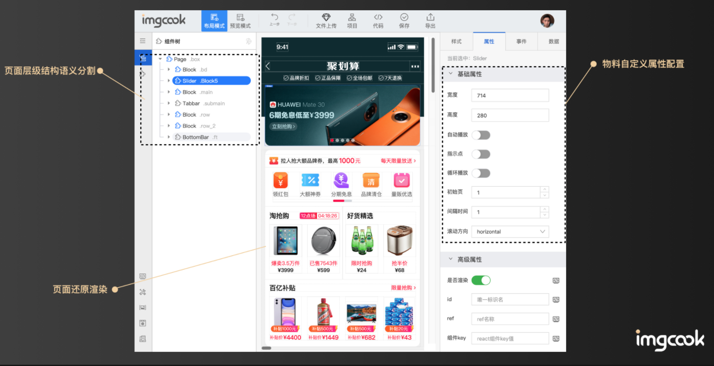

# 【Dawnlck】2020 前端可视化搭建小报告- 02 - 链路、架构和难点

> Gathered & writen by [Dawnlck 在掘金][author]
>
> 该篇主要简述前端可视化搭建的链路、架构和难点，部分小节的内容只有配图，后续有机会可以继续完善。

在开篇之前，我们先把视角提高一点，关注到**使用的链路**上，对于一个用户（研发 or 非研发），如何使用我们构建出的可视化搭建平台？

1. **Low-code**: 如果面向的是研发，场景是中后台或者 toB 的一些业务，我们需要搭建的就是低代码生产链路，用户只需要**改动少量的代码**就能完成一个应用或者页面的**全链路流程**。

   

2. **No-code**: 如果面向的是非研发（如产品经理、设计师），场景大多数都是一些简单的营销页面，使用者会希望完全不涉及任何代码，就能把一个页面或者多个页面发布到线上，同时还能保证**可维护**、**可迭代**、**可回退**、**可监控**。

   

了解了**使用者的链路**之后，我们再理解可视化搭建的一些设计思想会顺畅很多。

## 1. 可视化搭建架构

废话不多说，放上收集到的一些架构图：

1. 政采云 - 鲁班架构图

   

2. 京东 - MPM

   

3. 阿里淘系技术部 - iceluna

   

   

4. 阿里淘系技术部 - imgcook

   

5. 阿里妈妈 - 淘积木

   

6. 阿里 - 云凤蝶

   

从这些优秀的项目架构中，我总结出以下的一张更为清晰明了的架构图：

## 2. 可视化编辑器（核心） Low-code Visual Editor

编辑器需要完成什么？

- 组件的识别和导入
  - 获取组件属性描述
  - 生成组件 bundle
- 组件的拖拽和组合
  - **DSL 流派（半边代码半边实时呈现）** vs **Flex 流式编排** vs **类 PS、Sketch 自由编辑模式**
  - 组件树识别 && 行列格式化
  - 盒模型包含关系
- 组件的配置和扩展
  - 基本属性配置（如大小、颜色、背景、文本等）
  - 横向能力扩充（如 click 事件、悬浮提示、链接跳转等）
- 组件布局的自适应
  - 前端页面自适应解决方案（如 rem、弹性布局、grid 布局等）
- 组件的状态和联动
  - 打通通信渠道（如 http 通信、window 的 postMessage 等）
  - 状态外置（如 Redux、Vuex、Rxjs，也可以自研一个类似 Vue 响应式内核架构的发布订阅模型）

一个成熟的编辑器架构如下图所示：

## 3. 多端适配

1. iceluna - 多端适配

   

2. MPM - 多端适配

   

## 4. 物料和组件流通

## 5. 数据模型 Model / 数据约束 Schema

数据模型和数据约束是可视化搭建非常核心的一部分，良好的模型和约束设计能帮助我们更好地实现可视化搭建。

## 6. 海量部署

这里引入一套阿里的淘积木完成的海量部署方案。

我们在实现海量部署中，可能会遇到的一些关键性问题：

1. Node 缓存回收机制阈值管理
2. IPC 大文件传输
3. 冷部署和热部署、容灾管理

## 7. 微前端的应用

> 微前端：将前端整体分解为小而简单的块的模式。这些块可以独立持续开发、持续测试和持续部署，同时仍然聚合为一个产品出现在客户面前。

下图是微前端的架构示意图。

微前端的思路其实特别契合可视化搭建的需要，因为对于组件而言，我们尽可能地不对上传组件者如何实现组件进行限制，因为有些人会习惯用 React、Vue 或者 Angular，有些人会写一些原生 js 的组件，这就要求我们在封装组件完成搭建的时候，提供一个可兼容各种组件的容器，和微前端的思路不谋而合。

社区知名度较高的微前端解决方案是**single-spa**，飞冰在进行调研之后，结合自身的可视化搭建业务，提出了一种成熟的微前端方案**icestark**，应用在阿里创作者平台等项目上，大致的实现思路如下：

1.  引入框架应用（容器，Container）和子应用（项目，Item）的概念

    - 框架应用负责系统整体布局以及子应用的注册、加载与渲染。
    - 子应用是一个传统的 SPA 应用（可包含一个或多个页面），会打包出 bundle 同时发布到 CDN，那么我们需要在框架应用中注册管理所有子应用，然后在适当的时机加载对应的子应用 bundle 并将其渲染到指定节点（系统布局里面）

2.  捕捉子路由的变化

    和`vue-router`定义子路由很相似，而且也是通过劫持 history 的 API 实现路由捕获

3.  怎么渲染子应用到指定节点

    现代前端框架都提供了挂载的函数

    - React `ReactDOM.render(<App />, document.getElementById('#root'))`
    - Vue `Vue.createApp(Counter).mount('#counter')`

    如果不是用框架实现的，也可以用原生 js 封装一个`mountJsChildApp`函数实现挂载

笔者发现飞冰在公开的技术文档里似乎没有提及的一个问题：不同的子应用之间如何共享状态数据？

这里给出一个解决方案，可以用`Rxjs`注入到子应用里，完成全局的状态管理，如状态的监听、广播以及推送。

## 8. Serverless

Serverless 也是非常前沿的一个技术，但其实使用起来不会那么复杂，只要了解它的作用，就能明白如何结合 serverless 的能力。

> 飞冰：基于 ServerLess 的能力，在前端项目中可以完成 api 的编写以及页面的渲染，不需要再创建一个后端应用。

那么 ServerLess 提供的到底是什么能力呢？这里引入腾讯云目前的爆款 Serverless 产品-云函数 SCF 的一段说明:

> 云函数 SCF 是腾讯云为企业和广大开发者们提供的无服务器执行环境，您无需购买和管理服务器，而只需使用平台支持的语言编写核心代码并设置代码运行的条件，代码即可在腾讯云基础设施上弹性、安全地运行。腾讯云完全管理底层计算资源，包括服务器 CPU、内存、网络和其他配置/资源维护、代码部署、弹性伸缩、负载均衡等。代码按需运行，空闲时不收费。使用云函数将帮您免除所有运维性操作，使您更加专注于核心业务的开发，实现快速上线和迭代，把握业务发展的黄金时期。

喔哦，原来是不用管服务器搭建了，而且还能负载均衡、按需运行，这还可以帮我们节省搭建的成本！

那么，怎么用呢？亲，**SSR** 可以了解一下！我们只要在**云函数 SCF** 里实现对页面的 **Render** 就行啦！

> 此处可能需要云服务商提供临时域名用于访问站点

## 9. AI（以 imgcook 为例）

> 目前 AI 从机器学习不断发展到了现在大热的深度学习（神经网络）， 未来 AI 到底能够发展得有多快谁也不知道，说不定我们就能在有生之年看到“奇点”的来临。

主要利用 AI 的识别和推导能力（识别也是一种推导）来协助可视化搭建，业内比较典型和成熟的成果如 **imgcook**，下面是几张关于该产品的说明图。

## 10. 其他的一些思考

实现前端可视化搭建是一个耗时长久的浩大工程，期间可能还会遇到以下技术难点，由于篇幅有限暂时不一一深入研究，后续有机会可以持续补充和完善：

1. 无限画布（允许用户在非常广阔的虚拟画布上进行创作）
2. 容灾系统（解决服务器宕机或者其他灾难发生时，保障用户数据的问题）
3. 代码可用率（检验是 low-code 还是 no-code 的最佳标准）
4. 多端多框架对接（涵盖大部分端，能够输出为各大框架下的代码）
5. 多人协同（方便团队协作快速完成一个大型的复杂应用）

## # 参考文章

这里很多资料，来源于本人参与的早早聊大会的讲师 PPT 材料，在这其中我也做了一些筛选和整合，加入了自己制作的图表，也欢迎各位关注这个干货满满的会议。

再列举一些其他参考的文章或者网站：

1. [《前端工程实践之可视化搭建系统（一）》][doc_01]
2. [《MPM 卖场可视化搭建系统 — 要素设计》][doc_02]
3. [Github - awesome-lowcode][awesome-lowcode]
4. [《阿里云原生 - 什么是低代码（Low-Code）？》][aliyun-lowcode]
5. [Wiki - 低代码开发平台][wiki-lowcode]
6. [《腾讯 - AlloyTeam - 页面可视化搭建工具技术要点》][alloyteam]
7. [《飞冰 - 面向大型工作台的微前端解决方案 icestark》][icestark]

[author]: https://juejin.cn/user/1028798614345032
[awesome-lowcode]: https://github.com/taowen/awesome-lowcode
[doc_01]: https://mp.weixin.qq.com/s/tPcIXCCQkdSXr_gTi8KT6A
[doc_02]: https://mp.weixin.qq.com/s?__biz=MzI5NjIzNjA1Nw==&mid=2247484054&idx=1&sn=f56e55e4dfdcea481e7881f9201f0c3b&chksm=ec4627e0db31aef6459de3c83e3bb320d2d7bc395de2a0aa5d595168de9d1f505099cb6374be&scene=178&cur_album_id=1581972507954315265#rd
[aliyun-lowcode]: https://juejin.cn/post/6900791928477417480
[wiki-lowcode]: https://zh.wikipedia.org/zh-cn/%E4%BD%8E%E7%A8%8B%E5%BC%8F%E7%A2%BC%E9%96%8B%E7%99%BC%E5%B9%B3%E5%8F%B0
[alloyteam]: http://www.alloyteam.com/2019/07/h5-build-tool-pipeline/
[icestark]: https://juejin.cn/post/6844903977859940360
