# 前端可视化搭建小报告 2020

> Gathered & writen by [Dawnlck 在掘金][author]

## 可视化搭建是什么？为什么？怎么做？

### 是什么？

"可视化搭建" 是指在图形界面上，通过一系列的编辑操作，在极短时间内便能完成一个复杂的页面并发布上线。

**可视化搭建**是高效利用组件的前端上层建筑，作为一个庞大的可视化前端应用, 它建立在大量的前端基建（如代码规范、脚手架、组件库、框架等）之上。

#### 常见的可复用代码片段的粒度

从可复用代码片段的颗粒度来看，我们通常接触到的概念如下：

基础组件、业务组件（区块\微件）、模板（页面主体）

- 基础组件，如各大组件库所完成的细粒度组件，`Button` \ `Input` \ `Form`。
- 业务组件，针对不同项目的业务场景，有一些场景可复用但不足以泛用的颗粒度较大的组件，我们将其封装为业务组件。
- 模板，颗粒度最大的组件，如活动页、表单页面模板、后台管理页模板、数据可视化模板，这些都是经过大量业务实践，证实可复用的页面主体架构

前两者我们可以通过组件库和业务微件库，形成通用的代码片段仓库，而模板我们也可以借由 GUI（图形用户界面，也可称为可视化管理平台），管理我们在业务中遇到的常用模板。

这里还有一张个人觉得很不错的模板可视化管理平台的截图，如下

#### 可视化构建如何整合？

可视化构建，通常会先调用一个模板作为基础骨架，然后通过控制组件的属性，调整组件的样式，使得大致的页面效果能够呈现出来，最后接入数据接口，进入构建和发布流程。

### 为什么？

> 随公司业务不断发展，营销活动、广告、页面改版等需求日益倍增，靠纯人工撸代码已经无法跟上需求增长速度。加班？招人？显得不够明智，也不够前端，提效也就成为了关键。如何提效？从何入手？那不得不提的就是前端提效神器 —— 可视化搭建系统。

> 当组织团队达到一定的开发规模时，页面可视化搭建是一个减少冗复开发、释放生产力的最有效方案。

对于前端可视化搭建的愿景，初步的理解可以如下：

调动所有非前端开发人力，释放前端开发的工作量，让**人人都能参与到页面的搭建中**，提升项目的交付效率。

当然可视化搭建的未来远不止于此，比如**对代码可用率的提升**，对 **DevOp 全链路的打通**，**结合 AI 的应用**等。

### 怎么做？

我们先从可视化搭建解决的痛点，或者说具有的能力维度，来分析这件事情。

关于架构层和一些实现的难点，移至下文中展开介绍。

## 可视化搭建架构

废话不多说，放上收集到的一些架构图：

1. 政采云 - 鲁班架构图

   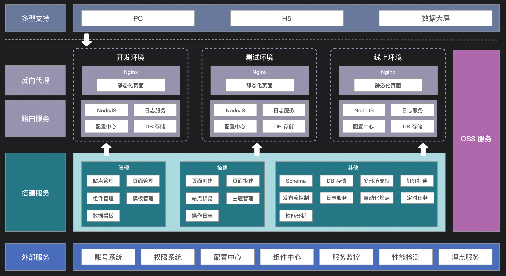

2. 京东 - MPM

   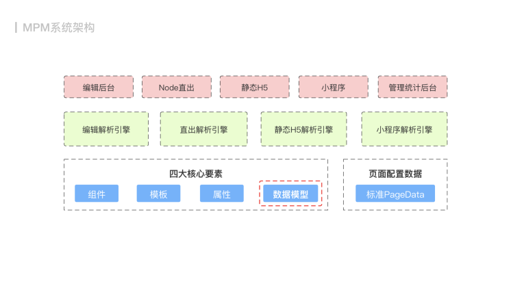

3. 阿里淘系技术部 - iceluna

   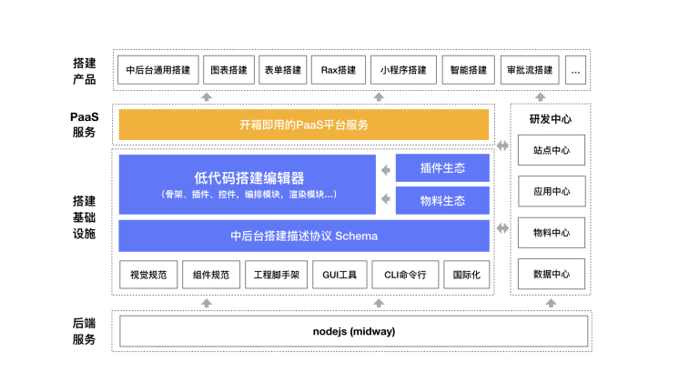

4. 阿里淘系技术部 - imgcook

   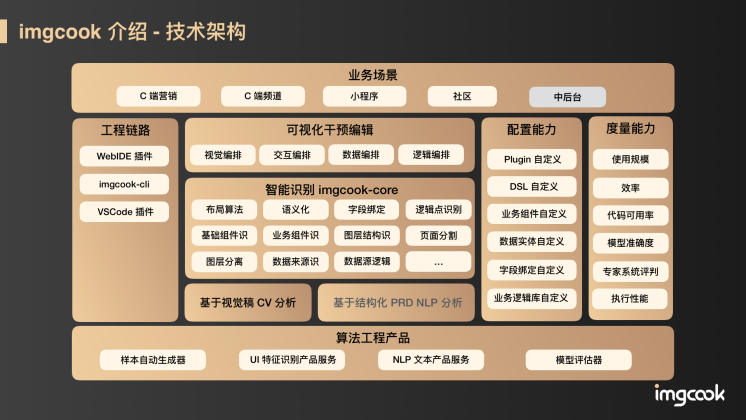

从这些优秀的项目架构中，我总结出以下的一张更为清晰明了的架构图：

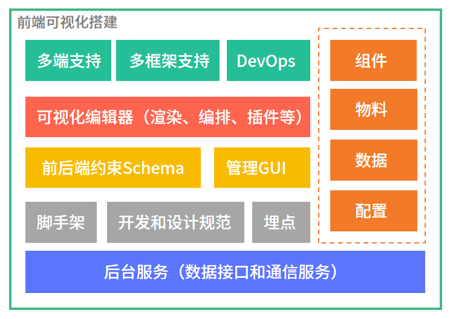

## 低代码可视编辑器 Low-code Visual Editor

## 多端适配

1. iceluna - 多端适配

   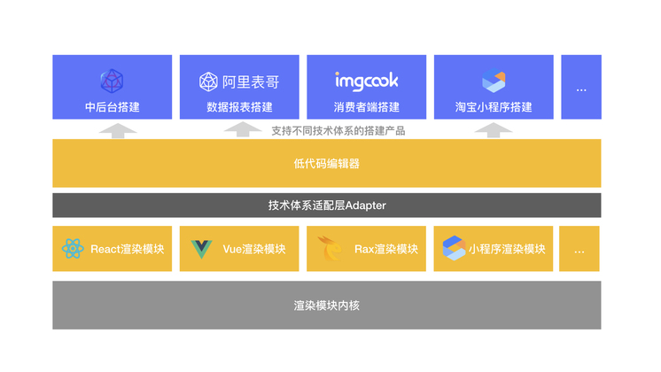

2. MPM - 多端适配

   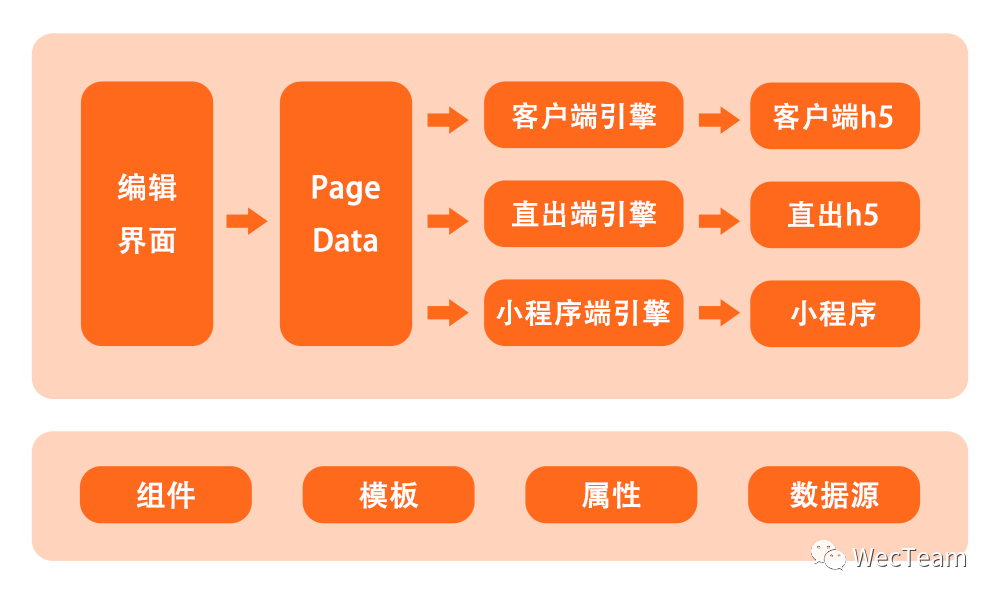

## 物料和组件流通

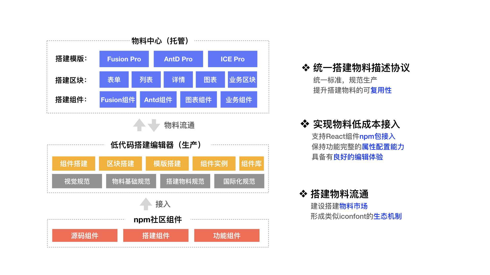

## 数据模型 Model / 数据约束 Schema

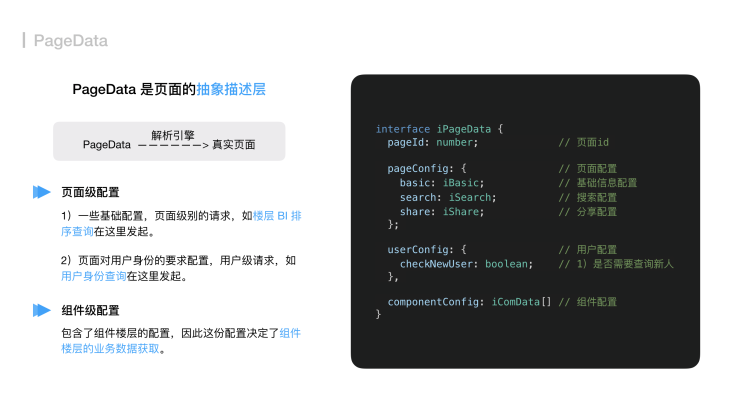
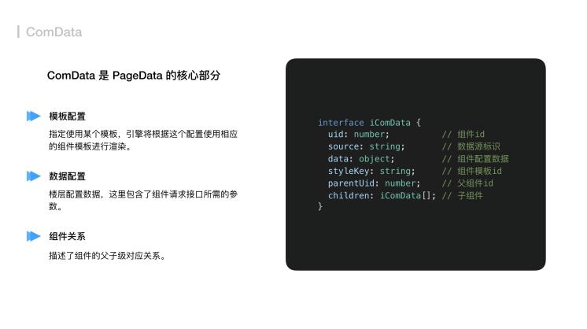

## 其他的一些思考

实现前端可视化搭建是一个耗时长久的工程，期间可能还会遇到以下技术难点：

1. 无限画布
2. 容灾系统
3. 代码可用率
4. 多端多框架对接
5. 多人协同

## 业内可视化的部分成果

Github 上有人专门维护了一个主题，列举了当前国内外一些知名的 LowCode 工具，详情见[awesome-lowcode][awesome-lowcode]

### 政采云 - 鲁班

### 京东 - MPM

### 阿里 - iceluna / imgcook / 方舟 / 天马 / 淘积木

1. iceluna（面向中后台的开发者）

   - 界面效果图

     

   - 功能模块设计

     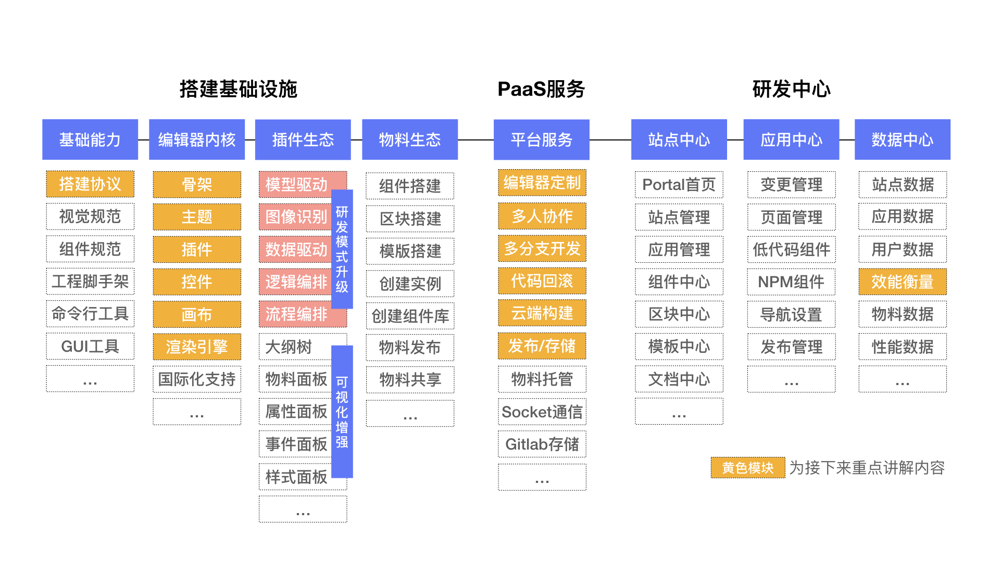

   - 研发流程设计

     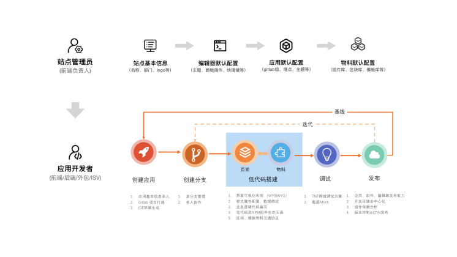

     

2. imgcook（设计稿代码智能生成）

   - 界面效果图

     

   - 发展历程和链路提效

     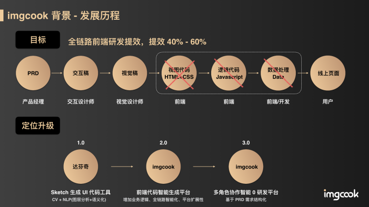

3. 方舟（营销活动页的可视化搭建）

   - 搭建页面

     

   - 模块中心

     

   - 终端体验

     

4. 天马（手淘、天猫等入口页的搭建）

   - 界面效果图

     

# 参考文章

这里很多来源于早早聊大会的讲师 PPT 材料，我也做了一些筛选和整合，加入了自己制作的图表，也欢迎关注这个干货满满的会议。

再列举一些其他应用到的文章或者网站：

1. [《前端工程实践之可视化搭建系统（一）》][doc_01]
2. [《MPM 卖场可视化搭建系统 — 要素设计》][doc_02]
3. [Github - awesome-lowcode][awesome-lowcode]

[author]: https://juejin.cn/user/1028798614345032
[awesome-lowcode]: https://github.com/taowen/awesome-lowcode
[doc_01]: https://mp.weixin.qq.com/s/tPcIXCCQkdSXr_gTi8KT6A
[doc_02]: https://mp.weixin.qq.com/s?__biz=MzI5NjIzNjA1Nw==&mid=2247484054&idx=1&sn=f56e55e4dfdcea481e7881f9201f0c3b&chksm=ec4627e0db31aef6459de3c83e3bb320d2d7bc395de2a0aa5d595168de9d1f505099cb6374be&scene=178&cur_album_id=1581972507954315265#rd
