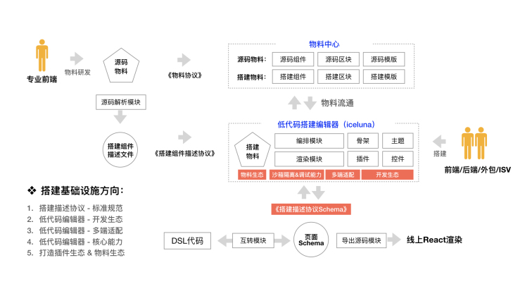
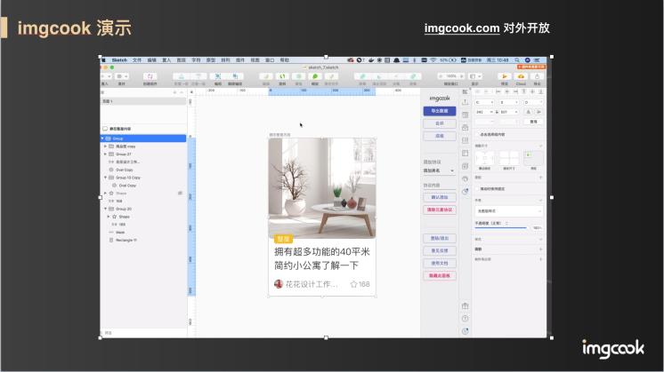
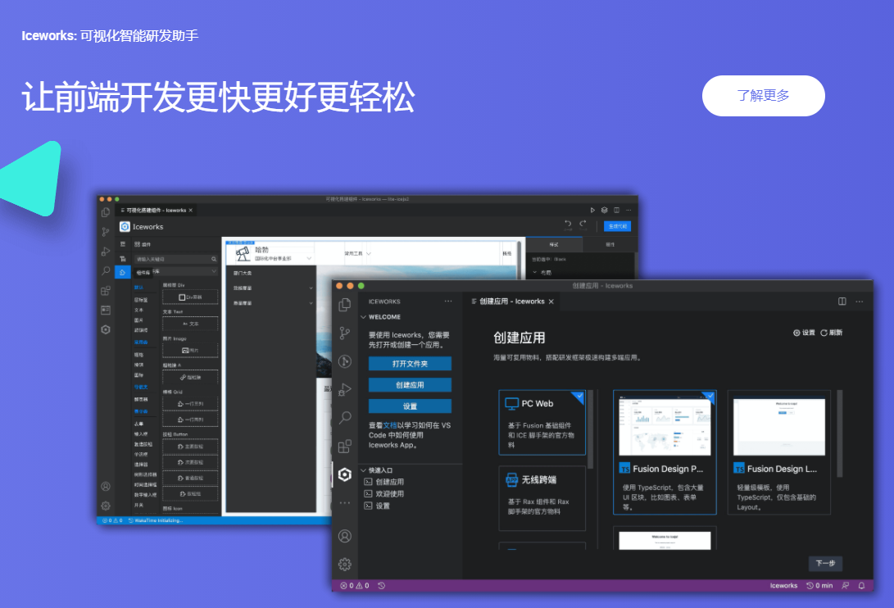
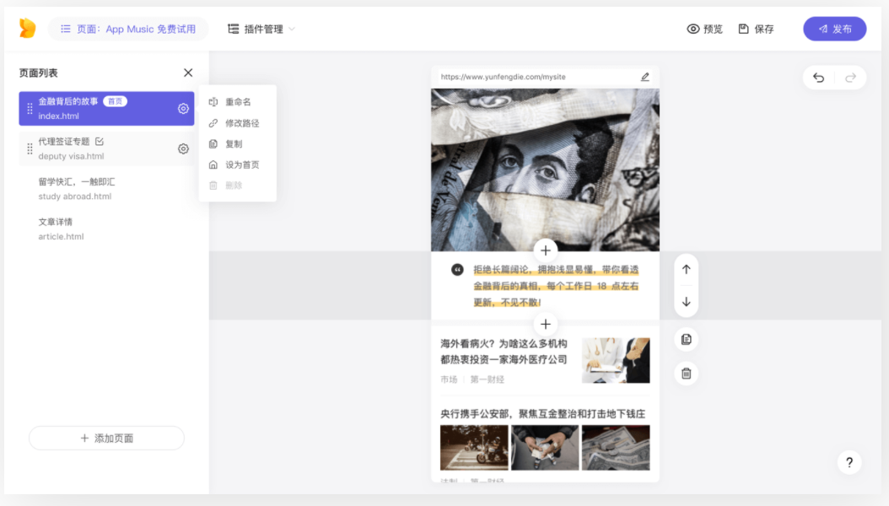
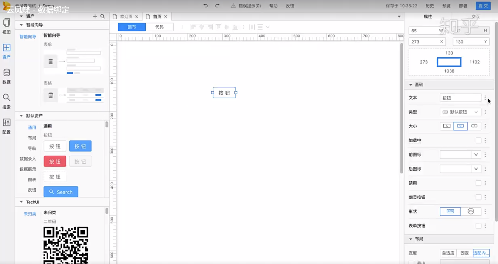
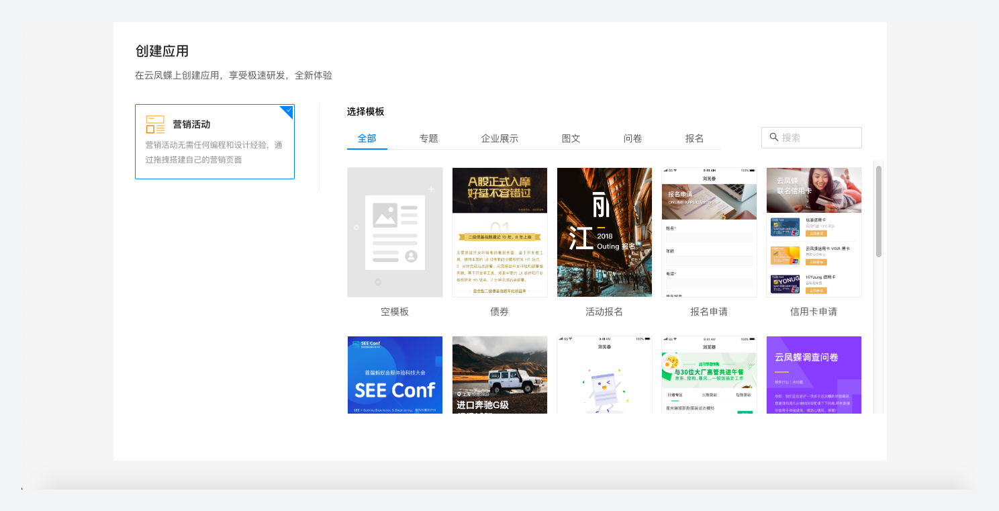
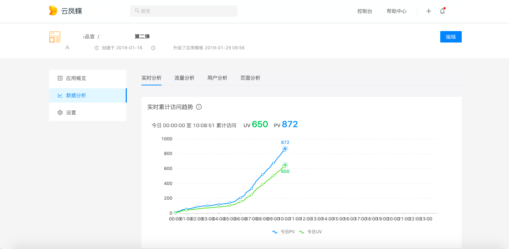

# 【Dawnlck】2020 前端可视化搭建小报告- 03 - 业内成果陈列

> 该篇报告涉及到的，仅仅是国内一些知名的前端可视化搭建成果，之后也会逐步加入其他的好项目或者国外的一些研究成果。

Github 上有人专门维护了一个主题，列举了当前国内外一些知名的 LowCode 工具，详情见[awesome-lowcode][awesome-lowcode]

## 1. 政采云 - 鲁班

## 2. 松果出行 - lego

面向活动页的前端可视化搭建。

## 3. 京东 - MPM

## 4. 阿里 - iceluna / imgcook / 方舟 / 天马 / 淘积木 / 飞冰 / 云凤蝶

1. iceluna（面向中后台的开发者）

   - 界面效果图

     

   - 研发流程设计

     

2. imgcook（设计稿代码智能生成）

   - 界面效果图

     

3. 方舟（营销活动页的可视化搭建）

   - 搭建页面

     

   - 模块中心

     

4. 天马（手淘、天猫等入口页的搭建）

   - 界面效果图

     

5. 淘积木（阿里妈妈营销页搭建工具）

   > 愿景：设计并实现一套可靠的**海量物料部署模块**

   - 基本界面结构

     

6. 飞冰（基于物料的前端可视化搭建平台）

   - icework

     

   - 组件/区块/模板

     

7. 云凤蝶（No-code 极简的页面编辑和云上建站服务）

   > 云凤蝶将于 2021 年 3 月 31 日关闭服务, 原因未知。

   - 界面（线上产品）

   

   - 界面（似乎是未公开的一个产品）

   

   - 模板库

   

   - 监测

   

## # 参考文章

这里很多资料，来源于本人参与的早早聊大会的讲师 PPT 材料，在这其中我也做了一些筛选和整合，加入了自己制作的图表，也欢迎各位关注这个干货满满的会议。

再列举一些其他参考的文章或者网站：

1. [《前端工程实践之可视化搭建系统（一）》][doc_01]
2. [《MPM 卖场可视化搭建系统 — 要素设计》][doc_02]
3. [Github - awesome-lowcode][awesome-lowcode]
4. [《阿里云原生 - 什么是低代码（Low-Code）？》][aliyun-lowcode]
5. [Wiki - 低代码开发平台][wiki-lowcode]
6. [《腾讯 - AlloyTeam - 页面可视化搭建工具技术要点》][alloyteam]
7. [《云凤蝶可视化搭建的推导与实现 - SEE Conf》][clouddie]
8. [《松果出行-活动可视化搭建系统——你的 KPI 被我承包了》][songguo]

[author]: https://juejin.cn/user/1028798614345032
[awesome-lowcode]: https://github.com/taowen/awesome-lowcode
[doc_01]: https://mp.weixin.qq.com/s/tPcIXCCQkdSXr_gTi8KT6A
[doc_02]: https://mp.weixin.qq.com/s?__biz=MzI5NjIzNjA1Nw==&mid=2247484054&idx=1&sn=f56e55e4dfdcea481e7881f9201f0c3b&chksm=ec4627e0db31aef6459de3c83e3bb320d2d7bc395de2a0aa5d595168de9d1f505099cb6374be&scene=178&cur_album_id=1581972507954315265#rd
[aliyun-lowcode]: https://juejin.cn/post/6900791928477417480
[wiki-lowcode]: https://zh.wikipedia.org/zh-cn/%E4%BD%8E%E7%A8%8B%E5%BC%8F%E7%A2%BC%E9%96%8B%E7%99%BC%E5%B9%B3%E5%8F%B0
[alloyteam]: http://www.alloyteam.com/2019/07/h5-build-tool-pipeline/
[clouddie]: https://zhuanlan.zhihu.com/p/101665976
[songguo]: https://juejin.cn/post/6889320306800852999
