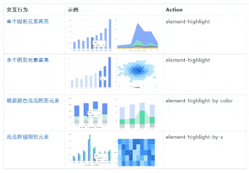
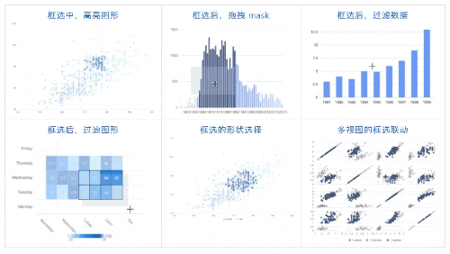

# Dawnlck - 前端数据可视化小报告 - 01 - 背景调研

## 前言

在上一次对可视化搭建进行分析研究后，对**数据可视化**也很感兴趣的笔者，就着手开始做数据可视化相关的一份小报告了。本次小报告因为篇幅的考虑，也分成了三块：01 背景调研 - 02 研究课题 - 03 业内成果陈列，此篇是第一部分，会从四个维度（What、Who、Why、How）来介绍前端数据可视化。

## What 数据可视化是什么？

在我们的真实世界里，数据无所不在。当我们用文字、图形、阿拉伯数字去试着表达我们接受到的数据，其实就是在完成一次数据可视化。

**数据可视化** 是利用人眼感知能力对数据进行的可视表达，以帮助用户`认识数据`、`洞察数据`、`理解数据`、`使用数据`的技术。

**数据可视化** 是创造性的设计美学、缜密的数据算法和严谨的工程技术结合的产物，用形象、有趣的形式呈现沉闷繁杂的数据。

对于我而言，数据可视化可以概括为如何挖掘数据之美。

> 早在 300 年前折线图、柱形图、饼图被发明，时至今日有了纷繁多样的数据可视化表现形态，而生产方式也从原始手绘到今天可以通过代码、工具自动生成，数据可视化领域跟过去相比已经有了翻天覆地的变化，特别是最近 10 年，随着 D3（D3: Data-Driven Documents IEEE InfoVis 2011） 以及大量统计图表类库和工具出现，让数据可视化设计和生产门槛大幅降低。

那么数据可视化涉及了哪些知识学科呢 📖？

## Who 面向的用户是谁

可以是**开发者**、**设计师**、**产品经理**、**BI 分析师**，也可以是 **C 端的消费者**、**企业客户**等等，数据流动至何处，与什么样的角色相接触，**数据可视化** 面向的用户就是谁。

## Why 为什么需要数据可视化

数据的可视化旨在帮助用户更好更快地理解数据背后的含义，它的作用有很多，以下列举了一小部分。

1. 数据洞察和分析
2. 辅助业务决策和业务提效
3. ....（此处有一千个哈姆雷特）

## How 如何实现各类数据的可视化

1. 学科知识基础

   首先，关于图形学和数学的相关知识，比如贝塞尔曲线、椭圆参数方程、仿射变化等，在这篇文章中[《掘金 - 2020 - 带你一起走进前端图形学》][juejin-02]有所提及，也有相当多的著作详细地对该领域学科进行了介绍（请看最后一张的推荐书籍）。

2. 图表类型

   在开发中，我们都知道由二十多种设计模式，在数据可视化中当然也存在着不同的数据可视化手段，分别对应着不同的数据场景。

   比如我们大家常见的柱状图和饼图，两种都适合二维的数据集，也都是能够反应数据的差异，前者利用高度差，后者利用面积差。对于差异并不明显的数据集，建议使用柱状图，因为人眼对面积的细微差异并不敏感，但是对于数据项较少的数据场景，比如部分和其他的比重占比差异，饼图更具有优势。

   所以，对图表的分类，以及使用规范的制定，都是很重要的。

   

   这里先简单引一下 **AntV** 对图表类型的九种分类，具体的每种分类对应了不同的子类和具体使用的差别。

   

   想了解更多，可以在[《AntV - 2018 - 图表分类》][antv_charts_classify]中看到有详细的说明，这边只取了其中的 **比较类** 的页面，作为一个例子作为说明。

   

3. 绘制手段

   那么对于这些图表，我们有什么可行的绘制手段吗，或者说浏览器的渲染引擎绘制图形有哪几种方式？如下图所示，针对二维的图表类型，我们有 DOM 、Canva、SVG 的实现方式，针对三维的立体数据可视化模型，则由 WebGL 进行支撑。

   

4. 图形语法

   **图形语法** 则是一套用来描述所有统计图形深层特性的语法规则，该语法回答了 **『什么是统计图形』** 这一问题，以自底向上的方式组织最基本的元素形成更高级的元素。

   常见的图形语法元素：

   - `数据 Data`：可视化最基础的部分。
   - `图形属性 Attribute`：负责将数据中的变量映射至图形空间。
   - `几何标记 Geometry`：即你在图表中实际看到的图形元素，如点、线、多边形等，每个几何标记对象含有多个图形属性，G2 的核心就是建立数据中的一系列变量到图形属性的映射。
   - `度量 Scale`：数据空间到图形属性空间的转换桥梁，每一个图形属性都对应着一个或者多个度量。
   - `坐标系 Coordinate`：描述了数据是如何映射到图形所在的平面的，同一个几何标记在不同坐标系下会有不同的表现。G2 提供了多种坐标系的支持：笛卡尔坐标、极坐标以及螺旋坐标等。
   - `可视化组件 Component`：也可以成为图表辅助元素，用于增强图表的可读性和可理解性，在 G2 中，提供了丰富的可视化组件，包括坐标轴 Axis，图例 Legend，提示信息 Tooltip，图形标记 Annotation，滑动条 Slider 等。
   - `分面 Facet`：描述了如何将数据分解为各个子集，以及如何对这些子集作图并联合进行展示，主要用于多维数据分析。

   想要了解更多？嚼一下 **《The Grammer of Grapics》** 这本书吧。

5. 交互语法

   **交互语法** 诞生于图表库疲于为业务做更改的时候，业务的千变万化需要不同的图表和不同的交互逻辑相组合，如果为每一个图表类型都做一遍交互的接口，付出的代价是非常大的，往往新增一个图表类型就需要考虑许多限制。

   交互语法让交互型的操作，从嵌入图表类的阶段，成长到了类似于依赖注入的新阶段。首先需要确定当前图表的状态，其次是用户传入的具体操作，然后是用户行为引发的虚拟状态刷新，最后是从旧状态到新状态的动画过渡。

   下面是 G2 关于交互语法的两个实现：高亮和区域选择。

   

   

## More 数据可视化工程

大多数对可视化的介绍，都聚焦于具体的数据可视化实现案例，而借用软件工程的定义，也可以提出数据可视化工程的定义：数据可视化工程可以概括为是一门研究如何用工程化的方法构建和维护有效的、实用的和高质量的数据可视化项目的学科。

如上图所示，阿里云的 DataV 团队为我们描绘了这样一个知识图谱，它大致包含三个方面：

1. 数据（基础）

   - 数据科学（统计学、特征工程、线性代数/线性拟合、数据挖掘、数据分类、数据洞察、数据孪生、城市科学等算法科研领域）
   - GIS（空间坐标系、地理信息数据等）

2. 图形（核心）

   - 图形学（几何、图论、图形语法、坐标系、渲染、单元数据可视化等）
   - 渲染引擎（Unity、UE4、VOGO 等，而图中的物理渲染、Shader、图形硬件 API 也应该属于此分类）

3. 全栈（框架）

   - 搭建（包含需求->规范->编码->调试->构建->部署->监控这样的研发闭环）
   - 大数据（数据治理、数据融合和数据调度，此处笔者认为应该纳入第一部分的数据科学分类下）

上述的前两个方面都偏向于研究层面，作为数据可视化工程的基石。最后一个则是应用层面，决定了数据可视化工程的最终产出质量。

## Case 一些经典的小例子 🌰

1. 四组数据的可视化

   

2. 鸢尾花数据集可视化

   

3. 一组设计精美的图表

   

## 经典文献

AntV 为我们提供了一些文献参考，如上图所示。其中标红的是 AntV 的起源也是设计核心 ———— Wilkinson 的著作 **《The Grammer of Grapics》** 图形语法，G2 的命名就来源于此，这本也是入门图形语法的必读书。该书主要分数据、变数、代数、几何、美学、空间、时间等共 15 个章节。

> 可惜的是，《The Grammer of Grapics》这本书正版的花费不菲，而且只有英文 = =，还好笔者英语还行。
> 这里也在网上找到了两份不完整的读书笔记可供参考：
>
> 1. [步茗 Neo - 1-3 & 6 章节 - 正经可视化](https://www.yuque.com/neowang/zjvis/zjvis_intro)
> 2. [羽依 - 1~5 章节 - The Grammar of Graphics 笔记](https://www.yuque.com/neowang/zjvis/zjvis_intro)

## 参考文章

1. [《掘金 - 2020 - 我对 web 前端与可视化的一些思考》][overview01]
2. [《掘金 - 2020 - 带你一起走进前端图形学》][juejin-02]
3. [《AntV - 2018 - 图表分类》][antv_charts_classify]
4. [《阮一峰 - 2014 - 数据可视化：基本图表》][ruan_basic]
5. [《CHARTIO - 2019 - How to Choose Between a Bar Chart and Pie Chart》][bar_pie]
6. [墨者学院 - 数据可视化入门教程][mozhe_school]
7. [AntV - 语雀 - 可视化私房菜][antv_school]
8. [SeeConf - 2020 - 第三届 SEE Conf 2020 视频回放 && PPT][seeconf3]
9. [御术（林峰） - 2018 - 数据可视化图形语法简史][yushu]
10. [萧庆 - 2020 - G2 - 交互语法专题][interactivegrammer]

[overview01]: https://juejin.cn/post/6865921593726468103
[juejin-02]: https://juejin.cn/post/6912086785405386765
[ruan_basic]: http://www.ruanyifeng.com/blog/2014/11/basic-charts.html
[antv_charts_classify]: https://antv-2018.alipay.com/zh-cn/vis/chart/index.html
[bar_pie]: https://chartio.com/learn/charts/how-to-choose-pie-chart-vs-bar-chart/
[mozhe_school]: https://www.yuque.com/mo-college/beginner-tutorial
[antv_school]: https://www.yuque.com/antv/blog
[seeconf3]: https://www.yuque.com/seeconf/2020/slide
[medium_guide]: https://medium.muz.li/guide-to-data-visualization-comparison-part-1-678382ceef00
[yushu]: https://my.oschina.net/kener/blog/1620513
[interactivegrammer]: https://www.yuque.com/antv/blog/ovznet
