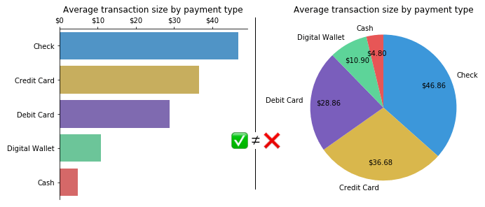
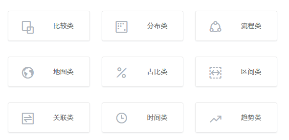
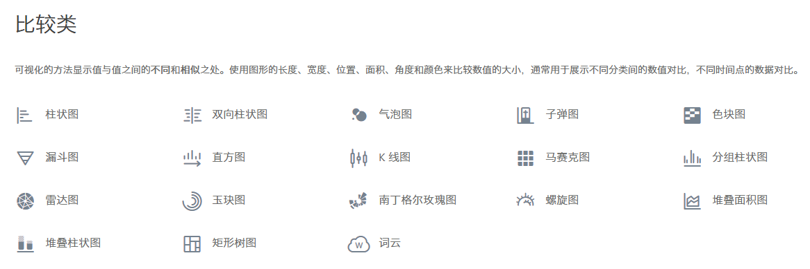
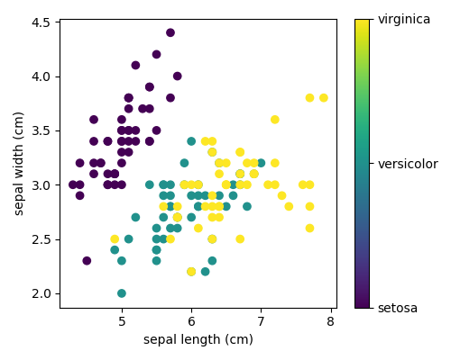

# Dawnlck - 前端数据可视化小报告 - 01 - 背景调研

> 在上一次对可视化搭建进行分析研究后，也来做一下对另一个前端可视化的领域 - **数据可视化** 的一份小报告。本次小报告因为篇幅的考虑，也分成了三块：01 背景调研 - 02 链路、架构和难点 - 03 业内成果陈列，此篇是第一部分，会从四个维度（What、Who、Why、How）来介绍前端数据可视化。

## What 数据可视化是什么？

**数据可视化** 是利用人眼感知能力对数据进行的可视表达，以帮助用户`认识数据`、`洞察数据`、`理解数据`、`使用数据`的技术。

**数据可视化** 是创造性的设计美学、缜密的数据算法和严谨的工程技术结合的产物，用形象、有趣的形式呈现沉闷繁杂的数据。

## Who 面向的用户是谁

可以是**开发者**、**BI 分析师**，也可以是 **C 端的消费者**，数据流动至何处，与什么样的角色相接触，**数据可视化** 面向的用户就是谁。

## Why 为什么需要数据可视化

1. 数据呈现会更为直观生动
2. 数据洞察和分析
3. 业务提效
4. ....（此处有一千个哈姆雷特）

## How 如何实现各类数据的可视化

首先，关于图形学和数学的相关知识，比如贝塞尔曲线、椭圆参数方程、仿射变化等，在这篇文章中[《掘金 - 2020 - 带你一起走进前端图形学》][juejin-02]有所提及

在开发中，我们都知道由二十多种设计模式，在数据可视化中当然也存在着不同的数据可视化手段，分别对应着不同的数据场景。比如我们大家常见的柱状图和饼图，两种都适合二维的数据集，也都是能够反应数据的差异，前者利用高度差，后者利用面积差。对于差异并不明显的数据集，建议使用柱状图，因为人眼对面积的细微差异并不敏感，但是对于数据项较少的数据场景，比如部分和其他的比重占比差异，饼图更具有优势。

这里先简单引一下 **AntV** 对图表类型的九种分类，具体的每种分类对应了不同的子类和具体使用的差别。

想了解更多，可以在[《AntV - 2018 - 图表分类》][antv_charts_classify]中看到有详细的说明，这边只取了其中的 **比较类** 的页面，作为一个例子作为说明。

那么对于这些图表，我们有什么可行的绘制手段吗，或者说浏览器的渲染引擎绘制图形有哪几种方式？如下图所示，针对二维的图表类型，我们有 DOM 、Canva、SVG 的实现方式，针对三维的立体数据可视化模型，则由 WebGL 进行支撑。

## Case 一些经典的小例子 🌰

1. 四组数据的可视化

   

2. 鸢尾花数据集可视化

   

## 参考文章

1. [《掘金 - 2020 - 我对 web 前端与可视化的一些思考》][overview01]
2. [《掘金 - 2020 - 带你一起走进前端图形学》][juejin-02]
3. [《AntV - 2018 - 图表分类》][antv_charts_classify]
4. [《阮一峰 - 2014 - 数据可视化：基本图表》][ruan_basic]
5. [《CHARTIO - 2019 - How to Choose Between a Bar Chart and Pie Chart》][bar_pie]
6. [墨者学院 - 数据可视化入门教程][mozhe_school]

[overview01]: https://juejin.cn/post/6865921593726468103
[juejin-02]: https://juejin.cn/post/6912086785405386765
[ruan_basic]: http://www.ruanyifeng.com/blog/2014/11/basic-charts.html
[antv_charts_classify]: https://antv-2018.alipay.com/zh-cn/vis/chart/index.html
[bar_pie]: https://chartio.com/learn/charts/how-to-choose-pie-chart-vs-bar-chart/
[mozhe_school]: https://www.yuque.com/mo-college/beginner-tutorial
