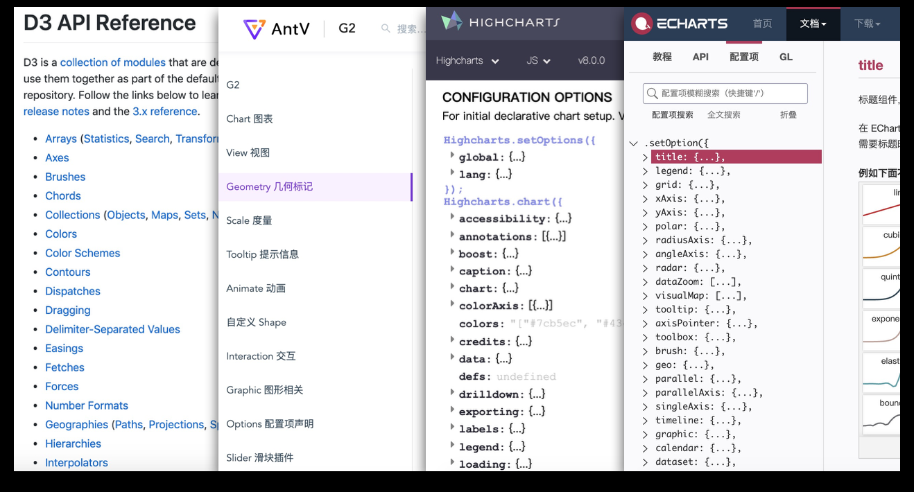

# Dawnlck - 前端数据可视化小报告 - 03 - 成果陈列

> 本次小报告因为篇幅的考虑，分成了三块：01 背景调研 - 02 链路、架构和难点 - 03 业内成果陈列，此篇是第一部分，会从四个维度（What、Who、Why、How）来介绍前端数据可视化。

## Case

## 国内可视化产品

### 1. AntV

### 2. ECharts

## 国外可视化产品

### 1. HighCharts

### 2. amCharts

### 3. D3.js

