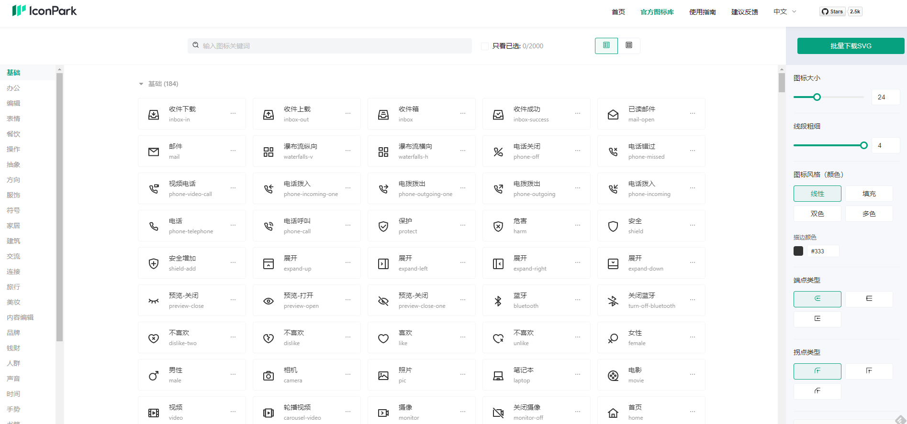
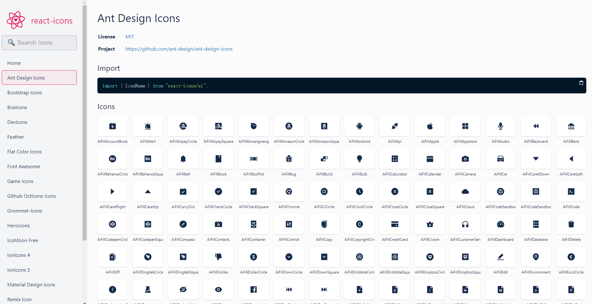
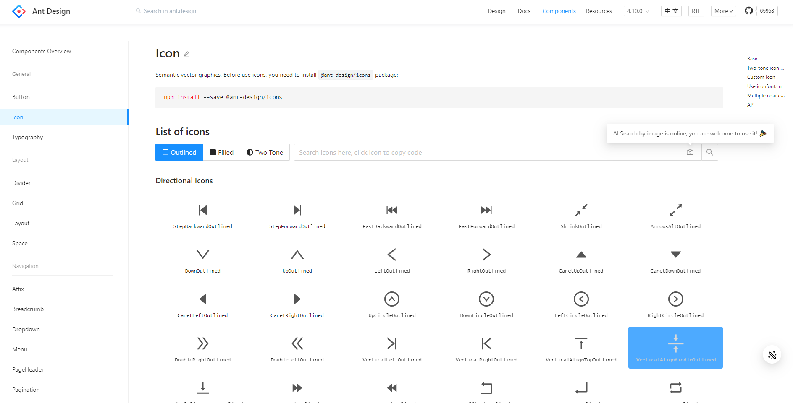
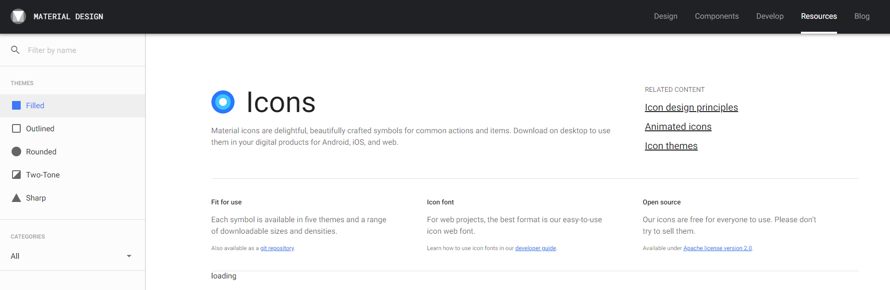

# 业务图标库 - 01 - 前期调研

## 1. IconPark

作者：字节跳动 - 飞书团队

- 需要使用`babel-import-plugin`
- 提供了在线编辑的能力

## 2. React-icons

作者：react-icons

作为各大图标库的入口，只是方便了查找，对于业务图标库而言还是无能为力。

## 3. Ant-design-icons

作者：Antd 团队

内部有 transform，但是要求比较严格，只能是符合 Antd 规范的图标，而且不够轻量易用。

## 4. Material Design Icon

作者： Google Material Design

其设计规范还是可以参考的，也是 Antd 现在参考的规范之一

